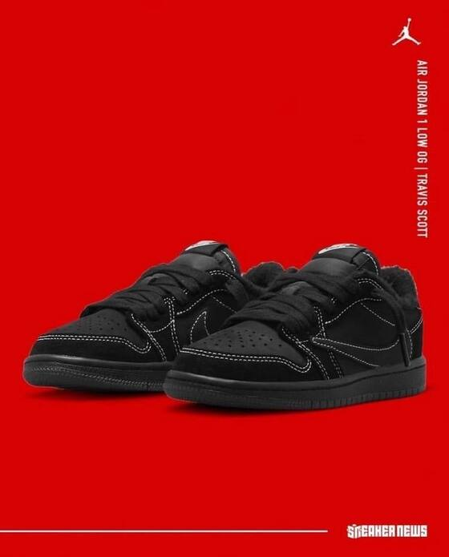
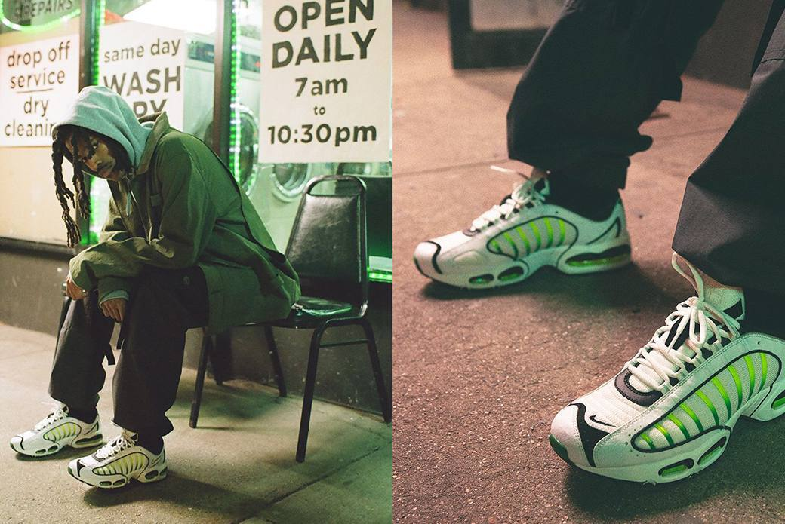

# GEVKROS.local
<!DOCTYPE html>
<html lang="en">

<head>
    <meta charset="UTF-8">
    <meta name="viewport" content="width=device-width, initial-scale=1.0">
    <meta http-equiv="X-UA-Compatible" content="ie=edge">
    <title>GEV KROS</title>
    <link rel="shortcut icon" href="img/icons/3532786.png" type="image/x-icon">
    <link href="https://fonts.googleapis.com/css?family=Roboto:300,400,700&amp;subset=cyrillic-ext" rel="stylesheet">
    <link href="https://cdn.jsdelivr.net/npm/bootstrap@5.2.3/dist/css/bootstrap.min.css" rel="stylesheet"
        integrity="sha384-rbsA2VBKQhggwzxH7pPCaAqO46MgnOM80zW1RWuH61DGLwZJEdK2Kadq2F9CUG65" crossorigin="anonymous">
    <link rel="stylesheet" href="css/style.css">
</head>

<body>
    <header>
        <nav class="top-menu">
            
            <ul class="menu-main">
                <li><a href="">Главная</a></li>
                <li><a href="">О Магазине</a></li>
                <li><a href="">Asics</a></li>
                <li><a href="">Adidas</a></li>
                <li><a href="">Nike</a></li>
                <li><a href="">Контакты</a></li>
            </ul>
        </nav>
    </header>
    <section class="history">
        

            

                

                    <h1 class="history_header">GEV KROS</h1>
                    <h2 class="history_subheader">СЕТЬ МУЛЬТИБРЕНДОВЫХ МАГАЗИНОВ ОДЕЖДЫ, ОБУВИ И АКСЕССУАРОВ</h2>
                    

                        Черпая вдохновение в ритме жизни крупных городов, GEV KROS представляет лучшие модели
                        кроссовок, актуальную обувь, одежду в спортивном стиле и аксессуары.
                         
                        Ассортимент GEV KROS
                        формируется из ключевых новинок известных спортивных производителей и товаров от брендов
                        категории лайфстайл.
                          Наша миссия: популяризация кроссовок, как неотъемлемой части гардероба
                        современного человека.
                    

                

            

        

    </section>
    <h1 class="karusel_first">Новинки от брендов</h1>
    

        

            <button type="button" data-bs-target="#carouselExampleCaptions" data-bs-slide-to="0" class="active"
                aria-current="true" aria-label="Slide 1"></button>
            <button type="button" data-bs-target="#carouselExampleCaptions" data-bs-slide-to="1"
                aria-label="Slide 2"></button>
            <button type="button" data-bs-target="#carouselExampleCaptions" data-bs-slide-to="2"
                aria-label="Slide 3"></button>
        

        

            

                
                

                    <h5>Travis Scott x Air Jordan 1 low OG TS SP Phantom</h5>
                

            

            

                
                

                    <h5>Nike Air Max Tailwind IV</h5>
                    
Nike Air Max Tailwind IV — силуэт из архивов линейки Nike Air Max Tn, впервые выпущенный в 1999
                        году.

                

            

            

                
                

                    <h5>Nike x Cactus Plant Flea Market</h5>
                    
В этот раз бренд отличился ярким и пушистым материалом, точно указывающий на сходство с Гринчем,
                        персонажем популярного мультфильма 2000-х. Сотрудничество настолько интересное, что даже сложно
                        уловить силуэт обычных Nike Dunk Low.

                

            

        

        <button class="carousel-control-prev" type="button" data-bs-target="#carouselExampleCaptions"
            data-bs-slide="prev">
            
            Previous
        </button>
        <button class="carousel-control-next" type="button" data-bs-target="#carouselExampleCaptions"
            data-bs-slide="next">
            
            Next
        </button>
    

    <!-- <section>
        

            
            

                <h5 class="card-title">Card title</h5>
                
Some quick example text to build on the card title and make up the bulk of the
                    card's content.

                <a href="#" class="btn btn-primary">Go somewhere</a>
            

        

        

            
            

                <h5 class="card-title">Card title</h5>
                
Some quick example text to build on the card title and make up the bulk of the
                    card's content.

                <a href="#" class="btn btn-primary">Go somewhere</a>
            

        

        

            
            

                <h5 class="card-title">Card title</h5>
                
Some quick example text to build on the card title and make up the bulk of the
                    card's content.

                <a href="#" class="btn btn-primary">Go somewhere</a>
            

        

        

            
            

                <h5 class="card-title">Card title</h5>
                
Some quick example text to build on the card title and make up the bulk of the
                    card's content.

                <a href="#" class="btn btn-primary">Go somewhere</a> 
            

        

    </section> -->
    
</body>

</html>